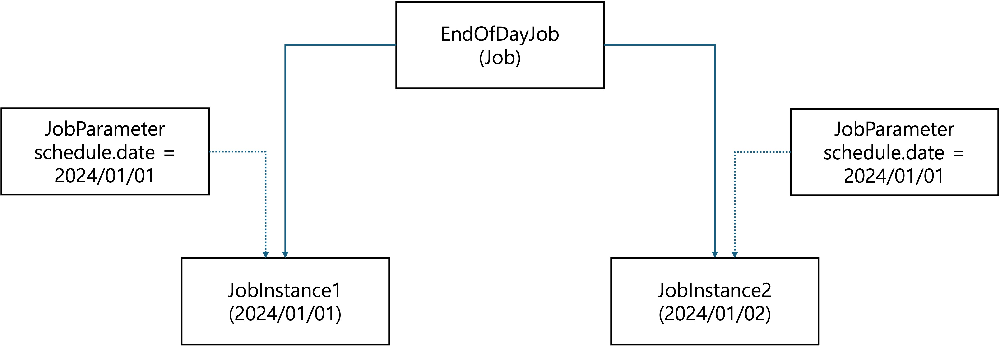

# 1. Spring Batch
## 1. Batch란?
1. 데이터를 실시간으로 처리하는게 아닌, 일괄적으로 모아 처리하는 작업을 의미한다.
2. 실시간으로 처리하여 사용자에게 빠른 응답을 해주어야 하는 서비스가 아닌 경우에 적용이 가능하다. ex) 서비스에 접속한지 1년이 이상이 지난 회원의 휴면 전환 작업
3. Batch Processing: 일괄 처리라고도 하는 과정으로 실시간으로 요청에 의해서 처리되는 방식이 아닌 일괄적으로 한꺼번에 대량의 프로세스를 처리하는 방식이다.
    - 대량의 데이터를 처리한다.
    - 특정 시간에 프로그램을 실행한다.
    - 일괄적으로 처리한다.

## 2. Spring Batch란?
1. Spring Batch는 트랜잭션 관리, 작업 처리 상태, 통계, 내결함성 기능 등 대용량 데이터 처리에 필수적인 기능들을 제공하는 프레임워크.
2. 멀티 스레드 처리 및 데이터 분할 기술을 통해 고성능 배치 작업을 가능하게 하는 고급 확장성 기능을 제공한다.
3. 주요 특징
    - 재사용성: 모듈화된 설계로 재사용 가능한 컴포넌트 제공.
    - 트랜잭션 관리: 데이터 일관성을 보장하기 위한 트랜잭션 관리 기능 제공.
    - 병렬 처리: 대규모 데이터 처리를 위한 병렬 처리 지원.
    - 재시도 및 오류 복구: 실패한 작업의 재시도 및 복구 기능.

## 3. Spring Batch 용어
1. 
2. Job
    - Job은 전체 배치 프로세스를 묶어주는 엔티티 객체.
    - Job은 하나 이상의 Step을 가진다.
3. Step
    - Step은 Job이 일괄 처리할 간단한 작업(파일 복사, 아카이브 생성 등) 또는 항목 중심 작업(데이터베이스에 데이터 저장)이 되는 작업의 단위.
4. JobRepository
    - 모든 배치 처리 정보를 담고있는 매커니즘
    - Job이 실행되게 되면 JobRepository에 JobExecution과 StepExecution을 생성하고 JobRepository에서 Execution 정보들을 저장하고 조회하며 사용하게 된다.
5. JobInstance
    - Job의 실행단위
    - Job을 실행시키면 하나의 JobInstance가 생성된다.
    - Job의 이름, 식별 키 등 정의와 관련된 모든 정보가 포함
6. JobParameter
    - JobInstance를 구별하는 역할
    - JobInstance에 전달되는 매개변수 역할
7. JobExecution
    - JobInstance에 대한 실행 시도에 대한 객체
    - JobInstance가 실패하여 재실행하여도 동일한 JobInstance가 실행되지만, JobExecution은 개별로 생긴다.
    - 시작 시간, 종료 시간, 상태 등 작업 실행과 관련된 모든 정보가 포함되고 Job이 실행될 때마다 JobExcution에 행이 하나씩 추가된다.
8. JobLauncher
    - Job과 JobParameters를 사용하여 Job을 실행하는 객체
9. Item
    - ItemReader : DB & File & XML 등 다양한 타입에서 batch data를 읽어온다.
    - ItemProcessor : 읽어온 데이터를 토대로 비즈니스 로직 처리
    - ItemWriter : 처리한 데이터를 DB(또는 파일)에 저장

## 3. JobInstance의 이해
1. Job한 번 정의될 수 있지만 일반적으로 설정된 일정에 따라 여러 번 실행될 가능성이 높다.
2. 스프링 배치에서 Job은 개발자가 지정하는 배치 프로세스의 일반적인 정의이다. 
3. Job의 실제 인스턴스를 생성하기 위해서는 JobInstance를 구현하여 사용한다.
4. JobInstance는 JobParameter에 의해 다른 JobInstance와 구분된다.
5. 

## 4. JobParameter
1. JobInstance는 로드할 데이터와는 전혀 무관하다.
2. Job을 기반으로 데이터가 로드될 방법을 지정하는 것은 전적으로 JobParameter에 달려있다.
3. JobParameter가 처리할 데이터를 구분하는 방식
    - 특정날짜
    - 특정파일
    - 테이블의 특정 레코드 범위